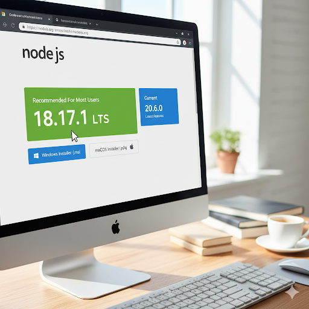
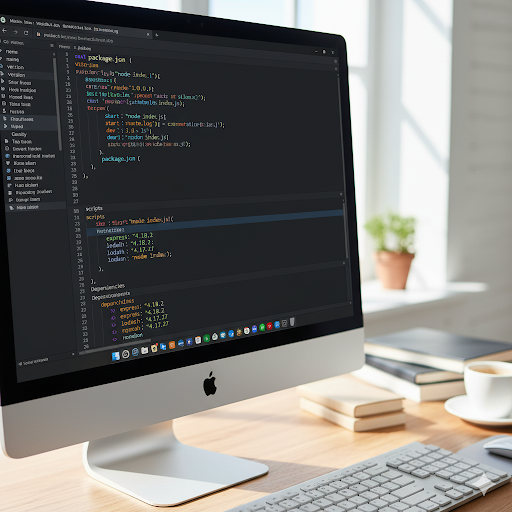
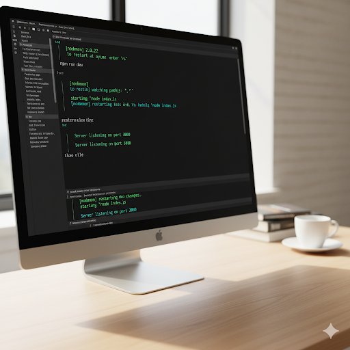

Node.js Basics
This guide covers fundamental concepts of Node.js, from installation to essential development practices.

🚀 Installing Node.js (LTS Version + npm basics)
To get started with Node.js, it's recommended to install the Long Term Support (LTS) version for stability. Node.js comes bundled with npm (Node Package Manager), which is crucial for managing project dependencies.

Installation Steps
Download Node.js: Visit the official Node.js website and download the LTS installer for your operating system.

Run the Installer: Follow the installation prompts. This process will add both Node.js and npm to your system's PATH.

Verify Installation: Open your terminal or command prompt and run these commands to ensure everything is installed correctly:

node -v
npm -v

Here's the README.md for your Node.js project, formatted with headings, text, and images.

Node.js Basics
This guide covers fundamental concepts of Node.js, from installation to essential development practices.

🚀 Installing Node.js (LTS Version + npm basics)
To get started with Node.js, it's recommended to install the Long Term Support (LTS) version for stability. Node.js comes bundled with npm (Node Package Manager), which is crucial for managing project dependencies.

Installation Steps
Download Node.js: Visit the official Node.js website and download the LTS installer for your operating system.

!

Run the Installer: Follow the installation prompts. This process will add both Node.js and npm to your system's PATH.

Verify Installation: Open your terminal or command prompt and run these commands to ensure everything is installed correctly:

node -v
npm -v

🔁 REPL and Lifecycle
The REPL (Read-Eval-Print Loop) is an interactive environment that lets you execute JavaScript code directly in your terminal and see the results immediately.

Using the REPL
To start the Node.js REPL, just type node in your terminal and press Enter.

You can type JavaScript expressions, declare variables, and test functions. To exit, press Ctrl + C twice.

Node.js Process Lifecycle
A typical Node.js application lifecycle is simple:

Start: The Node.js runtime executes your main JavaScript file.

Event Loop: Node's core, continuously checking for and processing events (like I/O and timers).

Code Execution: Your application logic runs.

Exit: The process ends when there are no more active events or when you explicitly terminate it.

🏗️ Node.js Architecture: V8 Engine, Event Loop, libuv, Worker Threads
Node.js is built on a powerful, efficient architecture.

🏗️ Node.js Architecture: V8 Engine, Event Loop, libuv, Worker Threads
Node.js is built on a powerful, efficient architecture.

V8 Engine: Node.js uses Google's V8 JavaScript engine to execute your code. V8 compiles JavaScript directly into fast machine code.

Event Loop: This is the heart of Node.js's non-blocking, asynchronous I/O model. It allows Node.js to handle many concurrent operations without creating a new thread for each one.

libuv: An underlying library that provides cross-platform asynchronous I/O operations (file system, networking, etc.). It powers the Event Loop's I/O capabilities.

Worker Threads: For CPU-intensive tasks, the worker_threads module lets you spin up separate threads, so you don't block the main event loop and make your application unresponsive.

🌍 Global vs. Window Object
Understanding the difference between the Global object in Node.js and the Window object in browsers is crucial.

Window Object (Browser): In web browsers, the window object is the global object, containing all browser-specific global variables, functions, and objects (e.g., document, alert).

Global Object (Node.js): In Node.js, there is no window object. Instead, the global object serves as the global namespace for all Node.js modules and variables. Common global objects include process, console, setTimeout, and __dirname.

📦 package.json (dependencies, scripts, versioning)
The package.json file is a manifest for your project. It's essential for managing your project's metadata, dependencies, and scripts.

Here's the README.md for your Node.js project, formatted with headings, text, and images.

Node.js Basics
This guide covers fundamental concepts of Node.js, from installation to essential development practices.

🚀 Installing Node.js (LTS Version + npm basics)
To get started with Node.js, it's recommended to install the Long Term Support (LTS) version for stability. Node.js comes bundled with npm (Node Package Manager), which is crucial for managing project dependencies.

Installation Steps
Download Node.js: Visit the official Node.js website and download the LTS installer for your operating system.

!

Run the Installer: Follow the installation prompts. This process will add both Node.js and npm to your system's PATH.

Verify Installation: Open your terminal or command prompt and run these commands to ensure everything is installed correctly:

Bash

node -v
npm -v
🔁 REPL and Lifecycle
The REPL (Read-Eval-Print Loop) is an interactive environment that lets you execute JavaScript code directly in your terminal and see the results immediately.

Using the REPL
To start the Node.js REPL, just type node in your terminal and press Enter.

!

You can type JavaScript expressions, declare variables, and test functions. To exit, press Ctrl + C twice.

Node.js Process Lifecycle
A typical Node.js application lifecycle is simple:

Start: The Node.js runtime executes your main JavaScript file.

Event Loop: Node's core, continuously checking for and processing events (like I/O and timers).

Code Execution: Your application logic runs.

Exit: The process ends when there are no more active events or when you explicitly terminate it.

🏗️ Node.js Architecture: V8 Engine, Event Loop, libuv, Worker Threads
Node.js is built on a powerful, efficient architecture.

!

V8 Engine: Node.js uses Google's V8 JavaScript engine to execute your code. V8 compiles JavaScript directly into fast machine code.

Event Loop: This is the heart of Node.js's non-blocking, asynchronous I/O model. It allows Node.js to handle many concurrent operations without creating a new thread for each one.

libuv: An underlying library that provides cross-platform asynchronous I/O operations (file system, networking, etc.). It powers the Event Loop's I/O capabilities.

Worker Threads: For CPU-intensive tasks, the worker_threads module lets you spin up separate threads, so you don't block the main event loop and make your application unresponsive.

🌍 Global vs. Window Object
Understanding the difference between the Global object in Node.js and the Window object in browsers is crucial.

Window Object (Browser): In web browsers, the window object is the global object, containing all browser-specific global variables, functions, and objects (e.g., document, alert).

Global Object (Node.js): In Node.js, there is no window object. Instead, the global object serves as the global namespace for all Node.js modules and variables. Common global objects include process, console, setTimeout, and __dirname.

📦 package.json (dependencies, scripts, versioning)
The package.json file is a manifest for your project. It's essential for managing your project's metadata, dependencies, and scripts.

!

A typical package.json file includes:

name: The name of your package.

version: The current version of your package.

scripts: Custom commands you can run with npm run <script-name>. For example, "start": "node index.js".

dependencies: Modules your application needs to run in production.

devDependencies: Modules only needed for development and testing.

To create a package.json file in your project directory, run:

npm init -y

👨‍💻 Using nodemon for Development
nodemon is a utility that automatically restarts your Node.js application whenever it detects changes in your source code. This eliminates the need to manually stop and start your server, significantly speeding up development.

Installation
Install nodemon as a development dependency:
npm install nodemon --save-dev

Here's the README.md for your Node.js project, formatted with headings, text, and images.

Node.js Basics
This guide covers fundamental concepts of Node.js, from installation to essential development practices.

🚀 Installing Node.js (LTS Version + npm basics)
To get started with Node.js, it's recommended to install the Long Term Support (LTS) version for stability. Node.js comes bundled with npm (Node Package Manager), which is crucial for managing project dependencies.

Installation Steps
Download Node.js: Visit the official Node.js website and download the LTS installer for your operating system.

!

Run the Installer: Follow the installation prompts. This process will add both Node.js and npm to your system's PATH.

Verify Installation: Open your terminal or command prompt and run these commands to ensure everything is installed correctly:

Bash

node -v
npm -v
🔁 REPL and Lifecycle
The REPL (Read-Eval-Print Loop) is an interactive environment that lets you execute JavaScript code directly in your terminal and see the results immediately.

Using the REPL
To start the Node.js REPL, just type node in your terminal and press Enter.

!

You can type JavaScript expressions, declare variables, and test functions. To exit, press Ctrl + C twice.

Node.js Process Lifecycle
A typical Node.js application lifecycle is simple:

Start: The Node.js runtime executes your main JavaScript file.

Event Loop: Node's core, continuously checking for and processing events (like I/O and timers).

Code Execution: Your application logic runs.

Exit: The process ends when there are no more active events or when you explicitly terminate it.

🏗️ Node.js Architecture: V8 Engine, Event Loop, libuv, Worker Threads
Node.js is built on a powerful, efficient architecture.

!

V8 Engine: Node.js uses Google's V8 JavaScript engine to execute your code. V8 compiles JavaScript directly into fast machine code.

Event Loop: This is the heart of Node.js's non-blocking, asynchronous I/O model. It allows Node.js to handle many concurrent operations without creating a new thread for each one.

libuv: An underlying library that provides cross-platform asynchronous I/O operations (file system, networking, etc.). It powers the Event Loop's I/O capabilities.

Worker Threads: For CPU-intensive tasks, the worker_threads module lets you spin up separate threads, so you don't block the main event loop and make your application unresponsive.

🌍 Global vs. Window Object
Understanding the difference between the Global object in Node.js and the Window object in browsers is crucial.

Window Object (Browser): In web browsers, the window object is the global object, containing all browser-specific global variables, functions, and objects (e.g., document, alert).

Global Object (Node.js): In Node.js, there is no window object. Instead, the global object serves as the global namespace for all Node.js modules and variables. Common global objects include process, console, setTimeout, and __dirname.

📦 package.json (dependencies, scripts, versioning)
The package.json file is a manifest for your project. It's essential for managing your project's metadata, dependencies, and scripts.

!

A typical package.json file includes:

name: The name of your package.

version: The current version of your package.

scripts: Custom commands you can run with npm run <script-name>. For example, "start": "node index.js".

dependencies: Modules your application needs to run in production.

devDependencies: Modules only needed for development and testing.

To create a package.json file in your project directory, run:

Bash

npm init -y
👨‍💻 Using nodemon for Development
nodemon is a utility that automatically restarts your Node.js application whenever it detects changes in your source code. This eliminates the need to manually stop and start your server, significantly speeding up development.

Installation
Install nodemon as a development dependency:

Bash

npm install nodemon --save-dev
Usage
Add a script to package.json:
Add a "dev" script to your package.json file like this:
"scripts": {
  "start": "node index.js",
  "dev": "nodemon index.js"
}
Run nodemon:
Now, start your application with:
npm run dev

nodemon will now watch for changes and automatically restart your server.

