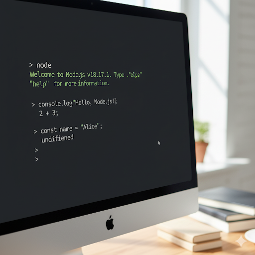

# Node.js Basics 🚀

This guide covers the fundamental concepts of **Node.js**.

---

## Node.js REPL & Lifecycle ⚡

### 🔄 What is REPL?

REPL stands for **Read-Eval-Print Loop**.  
It is an interactive shell that allows you to:

- **Read**: Accept user input (JavaScript code)
- **Eval**: Evaluate the input
- **Print**: Output the result
- **Loop**: Repeat the cycle until the user exits

---

### ▶️ Starting the REPL

Open your terminal and run:

```bash
node
```

You’ll enter the REPL environment, where you can run JavaScript commands directly.

**Example:**
```
> 2 + 3
5
> console.log("Hello, Node.js!")
Hello, Node.js!
```

#### 📌 Useful REPL Commands

- `.help` &rarr; Show all commands available in REPL
- `.exit` &rarr; Exit the REPL (or press <kbd>Ctrl</kbd> + <kbd>C</kbd> twice)
- `.clear` &rarr; Clear the REPL context
- `.load filename.js` &rarr; Load and run a JS file inside REPL
- `.save filename.js` &rarr; Save REPL session into a file

---

### 🔁 Node.js Lifecycle (Process Flow)

A Node.js process goes through the following stages:

1. **Initialization**
   - Node.js loads required modules
   - Environment variables are set
   - The event loop is prepared

2. **Execution**
   - Synchronous code runs first
   - Asynchronous operations (like timers, file I/O, or HTTP requests) are registered in the event loop

3. **Event Loop**
   - Keeps running as long as there are tasks to execute (callbacks, promises, timers, etc.)
   - Handles asynchronous operations efficiently

4. **Exit**
   - When no more work remains in the event loop, Node.js process exits
   - You can also force exit with:
     ```js
     process.exit();
     ```

---

## Node.js Architecture 🏗️

Node.js is built on a **non-blocking, event-driven architecture**, making it lightweight and efficient for handling large numbers of simultaneous connections.  
Its power comes from the combination of several core components:

- **V8 JavaScript Engine**
- **Event Loop**
- **libuv**
- **Worker Threads**

---

### ⚡ V8 JavaScript Engine

- Node.js uses **Google’s V8 engine**, the same engine that powers Google Chrome
- Written in **C++**, V8 compiles JavaScript into **machine code** instead of interpreting it, making execution extremely fast
- Node.js leverages V8 to run JavaScript on the server

**Example:**

```js
console.log("Hello from V8 engine!");
```
When executed, V8 compiles this JS code to machine code and runs it directly.

---

### 🔄 Event Loop

The event loop is the core of Node.js’s asynchronous, non-blocking I/O model.

It allows Node.js to handle thousands of concurrent operations without creating multiple threads for each request.

The event loop constantly checks the task queue and executes callbacks when operations are completed.

**Event Loop Phases:**

- **Timers** &rarr; Executes `setTimeout`, `setInterval`
- **Pending Callbacks** &rarr; Executes I/O callbacks
- **Idle/Prepare** &rarr; Internal tasks
- **Poll** &rarr; Retrieves new I/O events
- **Check** &rarr; Executes `setImmediate`
- **Close Callbacks** &rarr; Handles `socket.on('close')`

---

### ⚙️ libuv

- `libuv` is a C library that provides asynchronous I/O for Node.js
- Handles event loop and thread pool functionality
- Manages tasks like:
  - File system operations
  - DNS lookups
  - Network requests

`libuv` allows Node.js to delegate expensive operations (like file I/O) to a thread pool while keeping the main thread free for other tasks.

---

### 🧵 Worker Threads

- By default, Node.js runs on a single thread (the event loop)
- For CPU-intensive tasks (like image processing, encryption, or machine learning), this can block the event loop
- To fix this, Node.js provides Worker Threads, which run JavaScript in parallel threads

**Main thread:** Runs the event loop  
**Worker threads:** Run heavy computations without blocking

---

### 🧩 How Everything Works Together

- **JavaScript Code** &rarr; Runs on V8 engine
- **Async Tasks (I/O, timers, etc.)** &rarr; Handled by libuv
- **Event Loop** &rarr; Keeps track of tasks and executes callbacks
- **Worker Threads** &rarr; Handle heavy CPU-bound tasks in parallel

This architecture makes Node.js fast, scalable, and suitable for real-time applications like chat apps, streaming services, and APIs.



---

## package.json 📦

The **`package.json`** file is the heart of any Node.js project.  
It contains metadata about the project and manages **dependencies, scripts, and versioning**.

---

### 📌 What is `package.json`?

- Defines the project’s **name, version, description, author, and license**
- Keeps track of **dependencies** (libraries your project needs)
- Provides **scripts** to automate tasks
- Ensures project consistency across environments

You create a `package.json` file with:

```bash
npm init -y
```
This generates a default file with basic fields.

---

#### 🔑 Key Sections

1. **Dependencies**

   Dependencies are external packages your project needs.

   - `dependencies` &rarr; Installed with `npm install <package>`
   - `devDependencies` &rarr; Installed with `npm install <package> --save-dev` (used only in development, e.g., testing libraries)

2. **Scripts**

   The scripts section lets you define custom commands.

   **Example:**
   ```json
   "scripts": {
     "start": "node index.js",
     "dev": "nodemon index.js",
     "test": "echo \"No tests specified\" && exit 0"
   }
   ```
   Run them with:
   ```bash
   npm run start
   npm run dev
   npm test
   ```

---

## Using nodemon for Development 🔄

When developing a Node.js application, you usually need to **restart the server manually** after making code changes.  
This slows down development.

👉 **nodemon** solves this by automatically restarting your app whenever you make changes to your code.

---

### 📦 Installing nodemon

Install nodemon globally (available in all projects):

```bash
npm install -g nodemon
```

#### ▶️ Running with nodemon

```bash
npx nodemon index.js
```

#### ⚙️ Using nodemon in package.json

Update the scripts section:

```json
"scripts": {
  "start": "node index.js",
  "dev": "nodemon index.js"
}
```

Now run:

```bash
npm run dev
```

👉 This will start your app