# 📗 Learning Express.js with MongoDB (Native Driver)

This guide explains how to connect Express.js with MongoDB (without Mongoose).  
It combines step-by-step practice with theory and analogies so concepts are easier to remember.

---

## ⚡ Starting MongoDB

MongoDB is a NoSQL database that stores information as documents inside collections.  
Each document is like a flexible JSON object with key–value pairs.

**To start MongoDB locally:**

1. Open a terminal and run:
   ```bash
   mongosh
   ```
2. If MongoDB is active, you’ll see the shell prompt `>`.

3. Run `show dbs` to see existing databases.

> 💡 MongoDB creates new databases/collections only when data is inserted — you don’t need to set them up first.

---

## 🏗️ Learning Flow

```mermaid
flowchart TD
    A[Start MongoDB Server] --> B[Set up Express.js Server]
    B --> C[Connect Express.js to MongoDB]
    C --> D[POST /todos → Insert Data]
    D --> E[GET /todos → Retrieve Data]
    E --> F[Test APIs in REST Client]
    F --> G[View Results in MongoDB Compass]
```



---

## 📂 MongoDB Structure

- **Database** → container for collections (e.g., `todoApp`)
- **Collection** → group of related documents (e.g., `todos`)
- **Document** → one record (e.g., a single todo item)

**Example todo document:**

| Field       | Type     | Description                      |
| ----------- | -------- | -------------------------------- |
| `_id`       | ObjectId | Auto-generated unique identifier |
| `title`     | String   | The text of the todo             |
| `completed` | Boolean  | Whether the todo is done         |

---

## 🌐 API Endpoints Learned

| Method | Endpoint   | Purpose                   |
| ------ | ---------- | ------------------------- |
| `GET`  | `/`        | Returns a welcome message |
| `POST` | `/todos`   | Adds a new todo           |
| `GET`  | `/todos`   | Retrieves all todos       |

---

## 🔍 Testing APIs

Instead of using tools like Postman or curl, we used the **REST Client** extension in Visual Studio Code.  
It allows you to send HTTP requests and see responses without leaving your editor.

### 🛠️ Setting Up REST Client

1. Open VS Code.
2. Go to the Extensions Marketplace (left sidebar → square icon).
3. Search for **REST Client**.
4. Click **Install**.
5. You’ll now be able to write `.http` files in your workspace.

### 📝 Writing Requests

Create a new file in your project, e.g. `requests.http`.

Inside this file, you can write HTTP requests in plain text.

**Example content:**
```
### Root Route
GET http://localhost:3000/

### Create a Todo
POST http://localhost:3000/todos
Content-Type: application/json

{
  "title": "Todo from REST Client",
  "completed": false
}

### Get All Todos
GET http://localhost:3000/todos
```

- `###` is just a separator between requests.
- Each request can be executed separately.

### ▶️ Sending a Request

- Hover your mouse over a request line (e.g., `GET http://localhost:3000/`).
- A clickable “Send Request” link will appear above it.
- Click it → the REST Client will open a new panel showing the server’s response.

---

## 📩 Expected Responses

Depending on the request, here’s what you should see:

| Request       | Expected Response (Status & Body)                                                      | Meaning                                                 |
| ------------- | -------------------------------------------------------------------------------------- | ------------------------------------------------------- |
| `GET /`       | **200 OK**<br>`Hello, Express with MongoDB!`                                           | The server is running and reachable                     |
| `POST /todos` | **201 Created**<br>`{ "acknowledged": true, "insertedId": "…" }`                       | A new document was inserted into the `todos` collection |
| `GET /todos`  | **200 OK**<br>`[{ "_id": "…", "title": "Todo from REST Client", "completed": false }]` | Returns all todos stored in MongoDB                     |

---

## 💡 Common Cases

- **If MongoDB isn’t running:**  
  You’ll likely see a connection error in the terminal, and REST Client will return a 500 Internal Server Error.

- **If the server isn’t running (`npm start` not active):**  
  REST Client will show connection refused.

- **If you POST invalid JSON (e.g., missing quotes):**  
  Express won’t parse the body correctly, and you’ll get a 400 Bad Request.

This makes REST Client a super handy tool: you can quickly write, send, and check requests/responses without switching apps.

---

## 👀 Viewing in MongoDB Compass

- Connect to `mongodb://127.0.0.1:27017`
- Open the `todoApp` database
- Check the `todos` collection
- Documents appear in JSON form

---

## 📖 Analogy: MongoDB as a Library

Think of MongoDB as a library system:

| MongoDB Concept | Analogy           | Example       |
| --------------- | ----------------- | ------------- |
| Database        | Library building  | `todoApp`     |
| Collection      | Bookshelf         | `todos`       |
| Document        | Book on the shelf | One todo item |

---

## ✅ Review

In this guide, you practiced:

- Running MongoDB locally with `mongosh`
- Understanding MongoDB structure (databases → collections → documents)
- Using Express.js routes to interact with MongoDB
- Inserting data with POST and fetching data with GET
- Testing requests in VS Code with REST Client
- Viewing results in MongoDB Compass
- Remembering concepts through the library + librarian