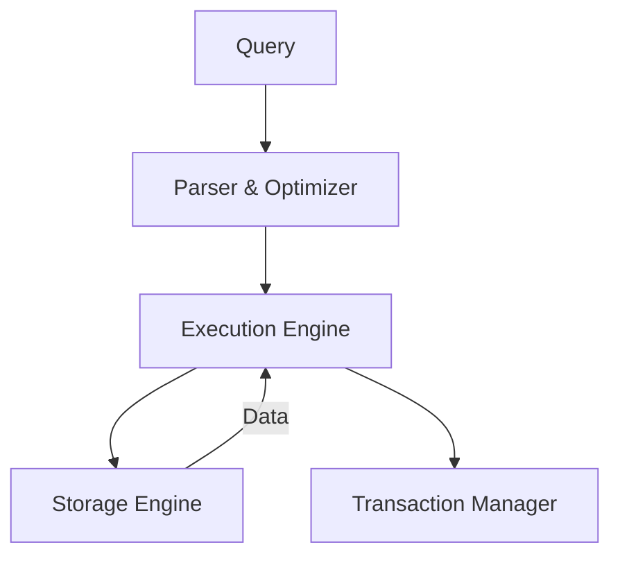
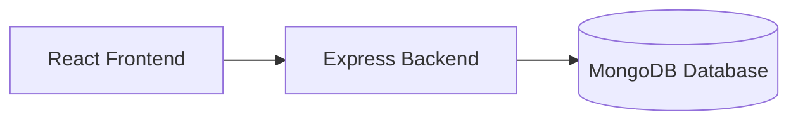

# 📚 Introduction to Databases in Full-Stack Web Development

Databases are the **foundation of persistent data storage** in web applications.  
They enable full-stack apps to **store, organize, and retrieve information** in a structured way that scales with users and complexity.

Without databases, developers would be stuck storing data in memory or flat files, leading to:  
- **Volatile storage** (data lost when the server restarts).  
- **Inefficient queries** (slow lookups in large files).  
- **Poor concurrency handling** (data corruption with multiple users).  

---

## 🔎 Why Do We Need Databases in Backend Web Apps?

1. **Persistence** → Data survives server crashes/restarts.  
2. **Efficiency** → Optimized for reads, writes, and queries.  
3. **Scalability** → Can handle millions of records across multiple servers.  
4. **Concurrency** → Multiple users can safely read/write simultaneously.  
5. **Security** → Backend acts as a **gatekeeper**; clients never talk directly to the DB.  
6. **Data Integrity** → Rules (constraints, validations) ensure correctness.  

---

## 🏗 Database in the Full-Stack Architecture

```mermaid
flowchart LR
    A[Frontend (React, HTML, Forms)] --> B[Backend (Node.js/Express)]
    B -->|SQL / NoSQL Queries| C[Database]
    C --> B
    B --> A
```

- **Frontend** → User interface (collects input, displays results).
- **Backend** → Business logic, validation, authentication.
- **Database** → Permanent storage + query processing.

👉 The frontend never connects directly to the DB. The backend enforces rules, prevents data leaks, and controls access.

---

## 🗂 SQL vs 📄 NoSQL Databases

| Feature        | SQL (Relational)                       | NoSQL (Non-Relational)             |
| -------------- | -------------------------------------- | ---------------------------------- |
| Data Model     | Tables (rows/columns)                  | Documents (JSON), Key-Value, Graph |
| Schema         | Fixed, predefined                      | Flexible, dynamic                  |
| Relationships  | Strong, enforced (joins, foreign keys) | Weak or manual                     |
| Query Language | SQL                                    | Varies: Mongo Query, Key ops, etc. |
| Scaling        | Vertical (bigger servers)              | Horizontal (many servers)          |
| Best Use Cases | Banking, ERP, e-commerce               | Social media, IoT, analytics       |
| Examples       | MySQL, PostgreSQL, SQLite              | MongoDB, Redis, Cassandra          |

**Quick Developer Shortcut**

- Structured, consistent, relational → **SQL**
- Flexible, evolving, document-like → **NoSQL**

---

## 📊 Database Architecture Basics

Modern databases consist of multiple layers:

- **Client / Query Interface** → Receives queries from backend.
- **Parser & Optimizer** → Validates query and chooses the fastest execution plan.
- **Execution Engine** → Executes the optimized plan.
- **Storage Engine** → Stores and retrieves data on disk or memory.
- **Transaction Manager** → Ensures safe multi-user access and ACID guarantees.



---

## ⚡ Indexes

**Definition:** Special data structures (B-Trees, Hashes) that speed up searches.

**Analogy:** Like the index of a book → jump to the right page without scanning everything.

**Trade-off:**
- Faster reads ✅
- Slower writes ❌ (index updates required on every insert/update).

**Example**

- **Without index:**
  ```sql
  SELECT * FROM users WHERE user_id = 42; 
  -- Scans all rows (slow if millions of users)
  ```
- **With index on user_id:** Lookup is instant.

Most RDBMS auto-index primary keys.

---

## 🔒 Transactions & ACID

A transaction = a group of DB operations treated as one.

- Either all succeed ✅
- Or all fail ❌ (rollback).

**ACID Properties**

| Property    | Meaning                                 | Example (Bank Transfer)                    |
| ----------- | --------------------------------------- | ------------------------------------------ |
| Atomicity   | All or nothing                          | Deduct + add money must both succeed       |
| Consistency | Rules must always hold                  | Balance can’t go negative                  |
| Isolation   | Transactions don’t interfere            | Two people can’t buy the last item at once |
| Durability  | Once committed, changes persist forever | Transfer survives crash                    |

👉 Used in payments, e-commerce, reservations.

---

## 🌍 Popular Databases

| Database   | Type              | Pros                                 | Cons                             | Use Cases                   |
| ---------- | ----------------- | ------------------------------------ | -------------------------------- | --------------------------- |
| MySQL      | SQL               | Simple, widely used, reliable        | Limited JSON support             | Web apps, CMS, blogs        |
| PostgreSQL | SQL               | Advanced queries, ACID strong, JSONB | Slightly heavier setup           | Enterprise, analytics, ERP  |
| MongoDB    | NoSQL (Docs)      | Flexible, JSON-like, scales easily   | Weaker joins, less strict schema | Social apps, profiles, logs |
| Redis      | NoSQL (Key-Value) | Super fast, in-memory cache          | Not suited for long-term storage | Caching, sessions, queues   |

---

## 🚀 Where MongoDB Fits in the Modern Stack

- **Type:** NoSQL Document Store (BSON/JSON-like).
- **Why Developers Love It:**
  - Schema flexibility → evolve data models quickly.
  - JSON integration → perfect for JavaScript (Node.js).
  - Horizontal scaling → huge data, high performance.
- **Modern Usage:**
  - Works seamlessly in the MERN Stack (MongoDB, Express, React, Node.js).
  - Used for user profiles, comments, logs, analytics, and any evolving data structure.



---

## ✅ Key Takeaways

- Databases are critical for persistence, security, and scalability.
- SQL vs NoSQL: choose based on structure vs flexibility.
- Indexes improve read performance but add write cost.
- ACID transactions guarantee reliability for critical operations.
- Popular DBs: MySQL, PostgreSQL, MongoDB, Redis.
- MongoDB is a natural fit for modern JS stacks due to JSON