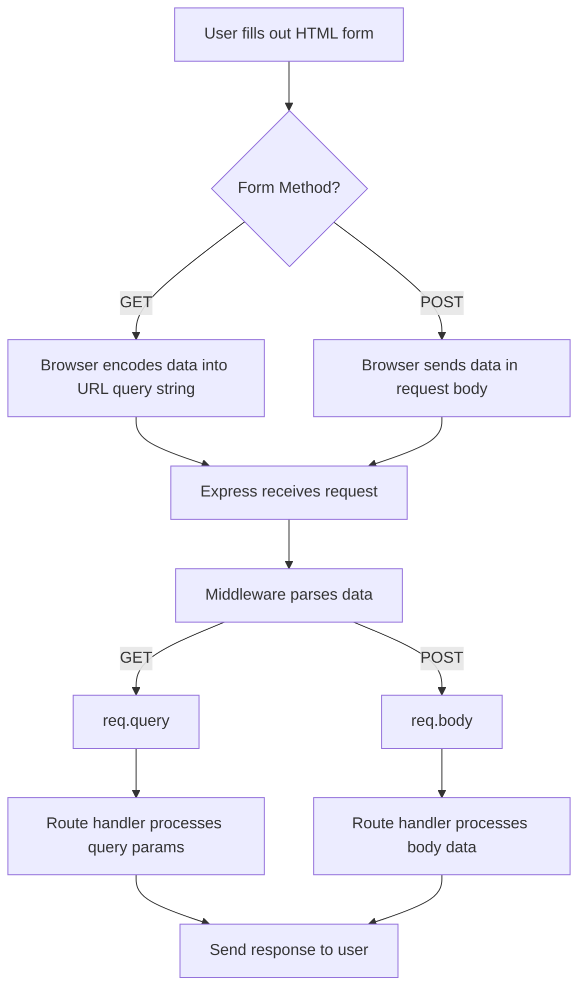

# 📌 Handling Form Submission in Express.js

## 📖 Overview

Form handling is a core feature of web applications. In Express.js, the most common way to handle forms is through the **POST** method, where data is securely sent in the request body.

This guide explains how to handle form submissions in Express.js with emphasis on the POST method, while also briefly touching on GET requests for completeness.

---

## ⚙️ Project Setup

**Initialize Project:**
```bash
mkdir express-form
cd express-form
npm init -y
npm install express
```

**Create Server File:**

- Create `app.js`
- Import and configure Express.

---

## 🏗️ Middleware for Parsing Data

To read form data in Express, you must enable middleware:

| Middleware                               | Purpose                                           |
| ---------------------------------------- | ------------------------------------------------- |
| `express.urlencoded({ extended: true })` | Parses data sent via **HTML forms (POST method)** |
| `express.json()`                         | Parses **JSON payloads** (optional, for APIs)     |

👉 Without this middleware, `req.body` will be undefined.

---

## 📩 POST Method (Main Focus)

### 🔹 What happens with POST?

- Data is sent inside the HTTP request body.
- The data is **not visible in the URL**.
- Best for sensitive data (e.g., passwords, emails, messages).

### 🔹 Example Workflow

**User fills out a form:**
```html
<form action="/submit" method="POST">
  <input type="text" name="username" placeholder="Enter username" />
  <input type="email" name="email" placeholder="Enter email" />
  <button type="submit">Submit</button>
</form>
```

**Express receives the data at `/submit`.**

**Middleware parses it and makes it available in `req.body`.**

**You can then use the submitted data:**
```js
app.post('/submit', (req, res) => {
  const { username, email } = req.body;
  res.send(`Username: ${username}, Email: ${email}`);
});
```

---

## 🔑 Accessing Submitted Data

| Method | Where to find data | Example access      |
| ------ | ------------------ | ------------------- |
| POST   | `req.body`         | `req.body.username` |
| GET    | `req.query`        | `req.query.q`       |

---

## 🔐 Handling Spaces & Special Characters

- Browsers automatically URL encode spaces and special characters.
- Express automatically decodes them for you when using `req.body`.

| User Input          | Encoded in Transmission | Express Output      |
| ------------------- | ----------------------- | ------------------- |
| `Hello World`       | `Hello+World` or `%20`  | `Hello World`       |
| `Node.js & Express` | `Node.js+%26+Express`   | `Node.js & Express` |

👉 If needed, you can manually encode/decode:

```js
encodeURIComponent("Hello World!") // → Hello%20World%21
decodeURIComponent("Hello%20World%21") // → Hello World!
```

---

## 🔄 Form Submission Flow (POST & GET)



---

## ✅ Summary

- **POST** method is the most common and secure way to handle forms.
- Use `express.urlencoded()` middleware to access submitted data in `req.body`.
- Express automatically decodes spaces and special characters.
- Use **GET** method only for search/filter data that can safely appear in URLs.

---

## 📊 Quick Comparison Table

| Feature          | GET Method                        | POST Method (Recommended)       |
| ---------------- | --------------------------------- | ------------------------------- |
| Data Location    | `req.query`                       | `req.body`                      |
| Data Visibility  | Visible in URL                    | Hidden in request body          |
| Max Data Length  | Limited (URL length restrictions) | Virtually unlimited             |
| Security         | Less secure                       | More secure                     |
| Common Use Cases | Search, filters, pagination       | Login,