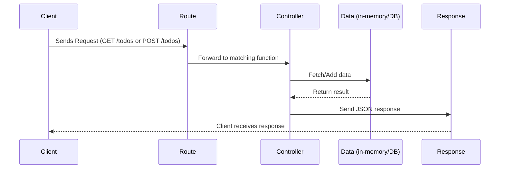

# 📘 Express Controllers with a Todo App

## 📖 Introduction

In Express.js applications, **controllers** are used to separate route definitions from business logic.  
This improves:

- **Organization** → Routes stay clean and readable.
- **Maintainability** → Logic is centralized in one place.
- **Reusability** → Same controller can be reused across multiple routes.

This README demonstrates controllers in Express using a Todo App.

We’ll cover:

- Project structure
- Routes vs Controllers
- Flow of a request
- How to test endpoints

---

## 🏗 Project Structure

A clean folder layout makes projects scalable:

```
todo-app/
├── app.js
├── routes/
│   └── todoRoutes.js
├── controllers/
│   └── todoController.js
├── README.md
```

---

## 🔄 Flow of Request



---

## 🔗 Routes vs Controllers

| **Aspect**     | **Route**               | **Controller**                  |
| -------------- | ----------------------- | ------------------------------- |
| Responsibility | Define the **endpoint** | Define the **logic**            |
| Example        | `/todos`, `POST /todos` | Add new todo, return all todos  |
| Location       | `routes/todoRoutes.js`  | `controllers/todoController.js` |
| Code Style     | Small, declarative      | Longer, contains logic          |

---

## 📝 Example: Todo App

### Controller Functions (`controllers/todoController.js`)

- **getTodos** → Return all todos.
- **addTodo** → Add a new todo from request body.

### Route Definitions (`routes/todoRoutes.js`)

- **GET /todos** → Calls `getTodos`.
- **POST /todos** → Calls `addTodo`.

---

## 🚀 Running the App

**Install dependencies:**
```bash
npm install
```

**Start server:**
```bash
node app.js
```

Server runs at:  
[http://localhost:3000](http://localhost:3000)

---

## 🧪 Testing the POST /todos (Add Todo)

### 1. Using a Tool (Postman/Insomnia)

- **Method:** POST
- **URL:** `http://localhost:3000/todo/todos`
- **Headers:** `Content-Type: application/json`
- **Body:**
  ```json
  { "title": "Learn Controllers" }
  ```

### 2. Using cURL

```bash
curl -X POST http://localhost:3000/todo/todos \
  -H "Content-Type: application/json" \
  -d '{"title":"Learn Controllers"}'
```

### 3. Using Browser Console

```js
fetch("http://localhost:3000/todo/todos", {
  method: "POST",
  headers: { "Content-Type": "application/json" },
  body: JSON.stringify({ title: "Learn Controllers" })
})
.then(res => res.json())
.then(console.log);
```

---

## ⚖️ REST API Best Practices

- Use plural nouns for endpoints → `/todos`, not `/todo`.
- Keep routes declarative and controllers functional.
- Always use appropriate HTTP status codes (e.g., 201 Created for new resources).
- Add error handling for invalid inputs.

---

## 📊 Advantages of Using Controllers

- **Clarity** → Routes describe “what”, controllers handle “how”.
- **Scalability** → Easy to add new features like update/delete.
- **Team-friendly** → Developers can work on different controllers without conflicts.

---

## ✅ Summary

- Controllers separate logic from routes in Express.
- They make apps cleaner, easier to test, and maintainable.

**In this Todo App:**

- **Routes:** `/todos` endpoints
- **Controllers:** Functions