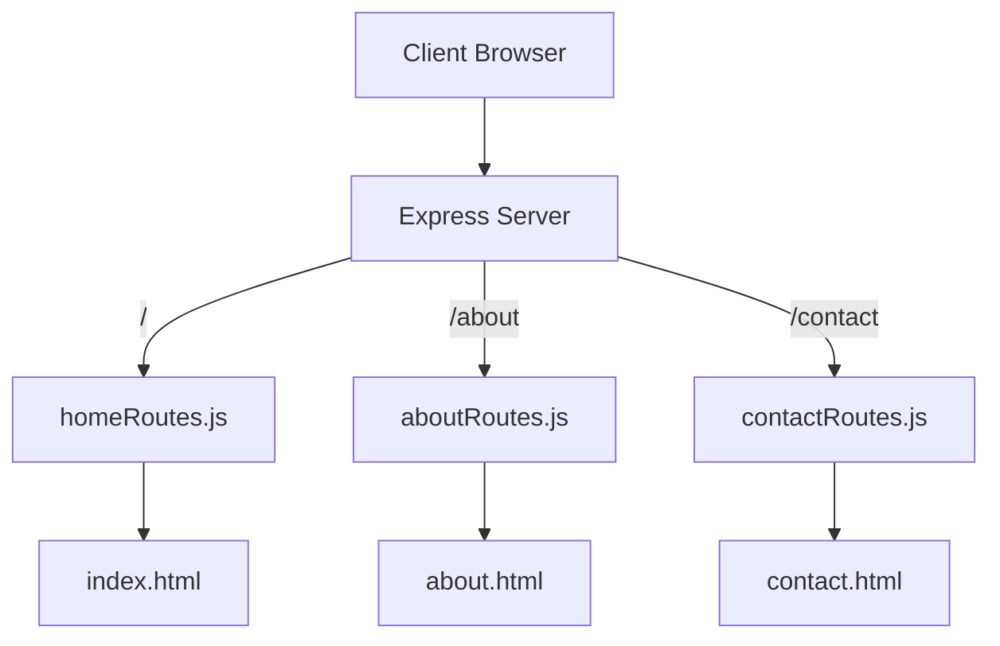

# 📘 Express Router in Node.js

Express Router is a sub-application of Express that allows you to break your application into multiple route files. Instead of keeping all routes inside a single `server.js`, you can organize them by feature or page.

Think of it like this:

> A library (**Express App**) with many bookshelves (**Routers**).  
> Each bookshelf (**Router**) organizes books (**Routes**) on a specific topic.

---

## 🤔 Why Do We Need Express Router?

Without Express Router, everything lives inside `server.js`, which quickly becomes messy.

### 🔴 Without Router

- All routes (`/home`, `/about`, `/contact`, etc.) are inside one file.
- Hard to read, hard to debug.
- Not scalable for larger projects.

### 🟢 With Router

- Each route (or group of routes) is stored in a separate file.
- Clear separation of concerns.
- Easy debugging and maintenance.
- Makes teamwork easier (different developers can work on different route files).

---

## 🖼️ Diagram



- The main server (`server.js`) acts as a traffic controller.
- Routers act as gateways to their respective pages.
- Each router file is responsible only for its own content.

---

## 📑 Key Concepts

| **Concept**            | **Explanation**                                      |
|------------------------|------------------------------------------------------|
| `express.Router()`     | Creates a mini Express application to handle routes. |
| `app.use()`            | Mounts a router on a specific path (e.g., `/about`). |
| Separation of Concerns | Each router handles only one feature/page.           |
| Scalability            | Easy to add new routers without touching old code.   |

---

## 📂 Project Structure

```
express-router-demo/
│
├── public/           → HTML files for each page
│   ├── index.html
│   ├── about.html
│   └── contact.html
│
├── routes/           → Router files
│   ├── homeRoutes.js
│   ├── aboutRoutes.js
│   └── contactRoutes.js
│
├── server.js         → Main entry point
└── package.json
```

---

## ⚙️ How It Works (Step by Step)

1. **Create Router Objects**  
   Each route file (like `aboutRoutes.js`) creates a router object using `express.Router()`.  
   That router is responsible for handling `about.html`.

2. **Export the Router**  
   The router object is exported so it can be used in `server.js`.

3. **Mount Routers in `server.js`**  
   `server.js` imports each router and tells Express where to mount it.  
   Example:  
   ```js
   app.use("/about", aboutRoutes);
   ```

4. **Request Flow**  
   - User requests `/about`.
   - The request goes to `server.js`.
   - `server.js` passes it to `aboutRoutes.js`.
   - `aboutRoutes.js` serves `about.html`.

---

## ✅ Benefits Recap

- **Cleaner Codebase** → each file is smaller and focused.
- **Scalable** → easy to add new routes in the future.
- **Debugging Friendly** → errors are isolated to specific files.
- **Teamwork Ready** → multiple developers can work on separate routers.

---

## 🧠 Quick Review

- **Express Router** = mini Express app inside your main app.
- Use `express.Router()` → make router objects.
- Use `app.use("/path", router)` → connect routers to main server.